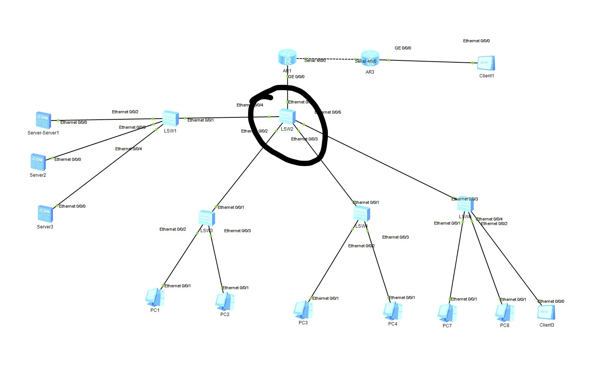
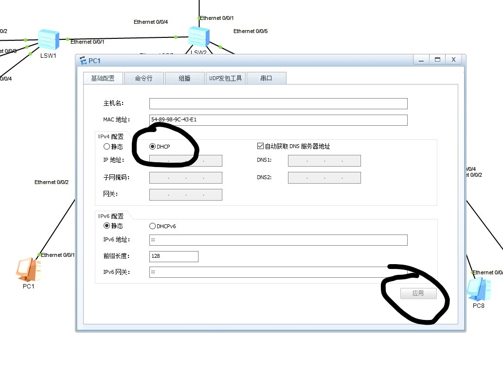
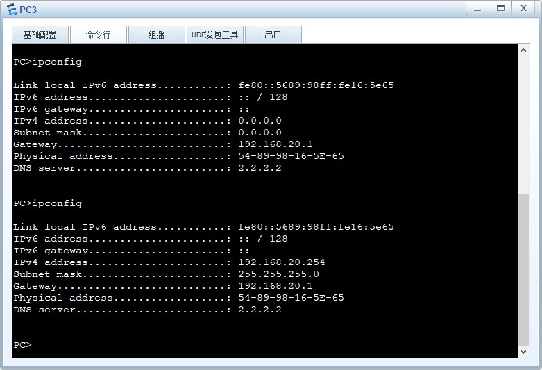
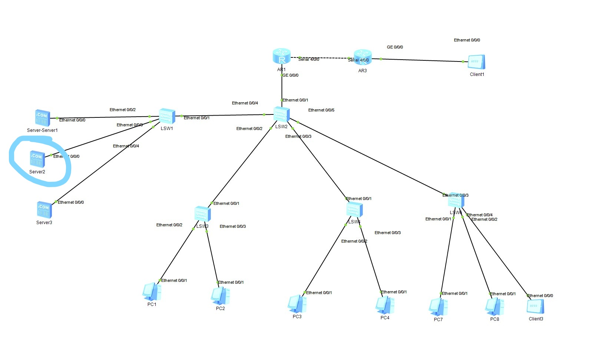
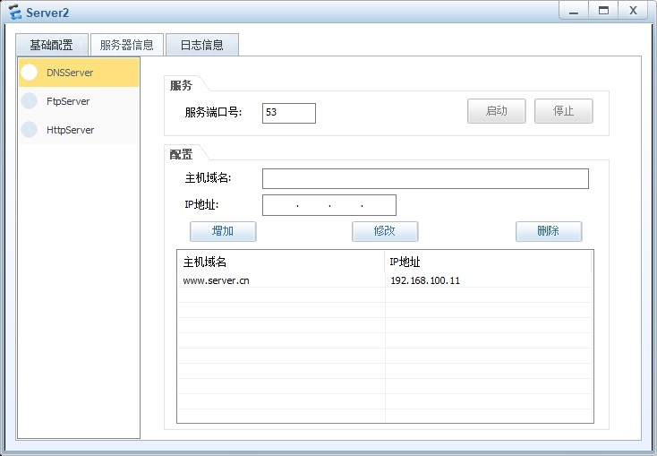
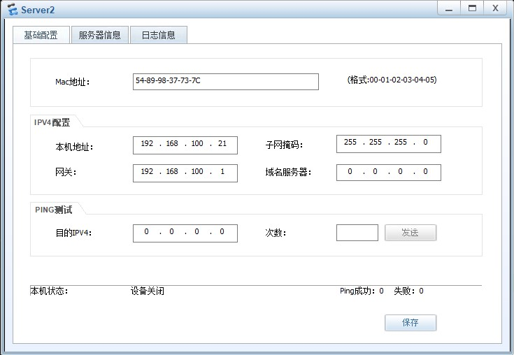
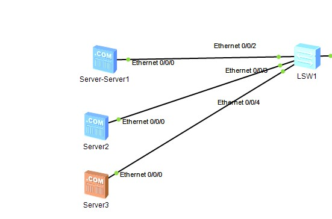
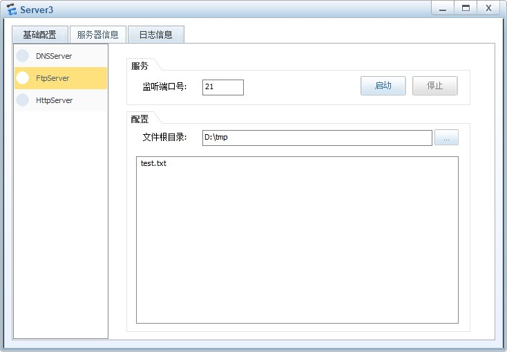
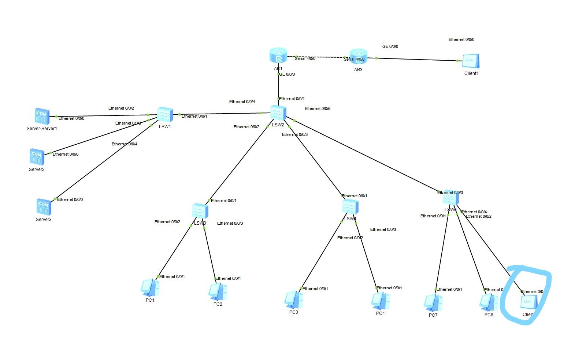
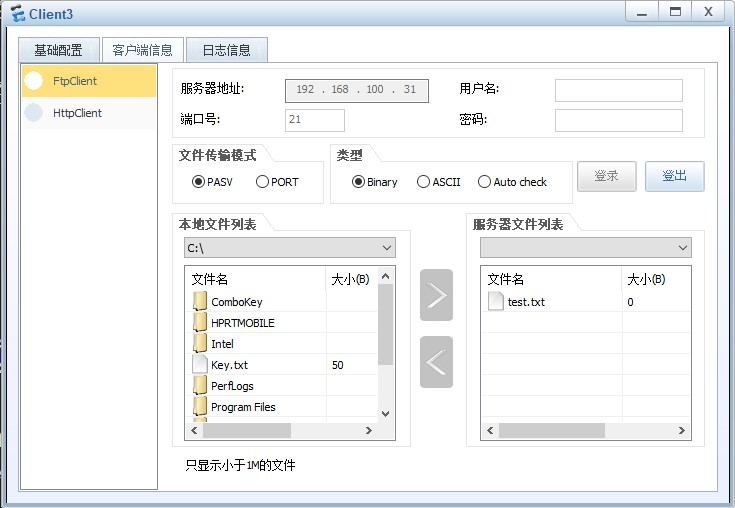

# 如何计网大作业

## 增加部门
1. 方法和之前的方法一样不多赘述

## 配置DHCP
1. 找到你的三级交换机  

2. 双击他，打开cli输入指令，并开启dhcp

    system-view
    dhcp-enable

3. 进入ip pool 这里的jiaoxue是ip pool的名字，之后会用到

    ip pool jiaoxue

4. 设置网关，这里的ip地址可以换成你的任何一个网段的网关

    gateway-list 192.168.10.1

5. 设置网络段，ip同理，注意最后一个是0

    network 192.168.10.0 mask 24

6. 设置DNS服务器地址，这里的地址再你配置完DNS服务器以后需要回来改,这个地址是我配置的DNS服务器地址

    dns-list 192.168.100.21

7. 设置ip分配时间为1天，如果想改这个数（没有用）可以自行百度

    lease day 1

8. 退出

    quit

9. 进入vlan,启动dhcp

    interface vlan 10

10.  找到你这个网络段的二级交换机 
11. 打开dhcp，设置trunk口（一定需要！），和dhcp转发（并不一定需要）

    system-view  

    dhcp enable

    int eth 0/0/1  
    port link-type trunk
    port trunk allow-pass vlan all
    quit

    int vlan 10
    dhcp select relay

12. 设置你的pc使用DHCP,点击DHCP并点击应用 
13. 打开pc命令行并输入

    ipconfig

14. 可见已经被自动分配ip地址，如果不行就多输入几次ipconfig，不行可以尝试去看几个网站，以下我学来这一套的地方。这是我学来配置三级交换机的地方:[eNSP的DHCP的三种配置](https://www.bilibili.com/read/cv14351927)。这是我学来配置中继的地方:[华为ensp三层交换机DHCP中继代理配置](https://blog.csdn.net/weixin_44657888/article/details/119644572)

## 配置DNS服务器
1. 向拓扑图中添加DNS服务器 
2. 配置服务器ip地址和域名映射
   1. 
   2. 
3. 点击启动按钮启动DNS服务器，注意上面配置DHCP时配置的dns-list后面的ip地址应与你配置的ip地址相同
4. 在DNS服务器的二级交换机上将DNS服务器分配至vlan

    int eth 0/0/3  
    port link-type access
    port default vlan 100
    quit

5. 如果你的pc可以ping到该DNS服务器的ip地址（这里就是192.168.100.21），那么你就应该能连接到DNS服务器了
   1. 
   2. 可见可以ping通配置的域名

## FTP服务器
1. 添加ftp服务器到拓扑图中
   1. 
2. 配置ftp服务器
   1. 
3. 点击启动开启服务器
4. 到二级交换机中分配端口和vlan，参见DNS服务器配置第四步
5. 如果没问题的话就可以在内网的client中登录ftp服务器了
   1. 
   2. 
    

    

    
    

    